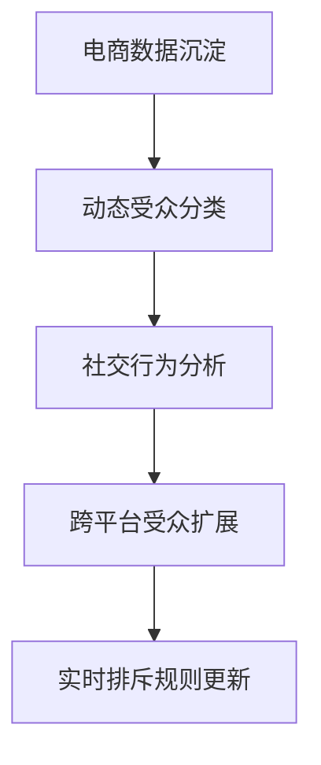

# Meta广告投放系统优化方法论

---

## 投放体系构建模型
（架构示意图：数据驱动型广告运营闭环）

---

## 精准受众分层策略
#### (一) 受众挖掘路径


#### (二) 分层管理标准
- 基础层：网站访客（30天留存）
- 转化层：加购未支付用户（7天强化）
- 价值层：高复购客户（生命周期维护）

---

## 素材优化管理系统
### (一) 智能测试模型
```ad-rotation
├─ 图片类型
│  ├─ 尺寸规格：1200x628 → 动态适配
│  └─ 创意组合：场景化展示+痛点放大
└─ 视频类型
   ├─ 时长梯度：6秒/15秒/30秒
   └─ 元素组合：产品特写+用户证言
```

### (二) 素材迭代机制
| 状态阶段 | 核心指标            | 优化动作                 |
|----------|---------------------|--------------------------|
| 导入期   | CTR<1%             | 文案AB测试+版位调整      |
| 成长期   | CPM波动>20%        | 时段分层+预算再分配       |
| 衰退期   | ROAS降幅>25%       | 素材版本全量更新          |

---

## 动态预算调控法则
### (一) 分时优化公式
```math
预算系数 = \frac{历史转化率}{时均竞争指数} × \sqrt{素材新鲜度}
```

### (二) 异常处理流程
```flow
st=>start: CPM突增30%
op1=>operation: 暂停超标广告组
op2=>operation: 启动替代广告方案
cond=>condition: CTR降幅≤15%?
op3=>operation: 时段拆分优化
op4=>operation: 全量素材替换
e=>end: 数据恢复基准值

st->op1->op2->cond
cond(yes)->op3->e
cond(no)->op4->e
```

---

## 客户挽回策略矩阵
### (一) 流失用户激活
```user-journey
浏览商品 → 加入购物车 → 放弃支付
     ↓           ↓           ↓
动态定价 → 限时提醒 → 专属优惠
```

### (二) 再营销触点设计
| 用户状态         | 触达时机           | 内容策略               |
|------------------|--------------------|------------------------|
| 浏览未点击       | 次日跨平台追投     | 痛点强化型文案          |
| 加购未支付       | 3小时后精准推送    | 限时优惠+库存预警       |
| 交易完成用户     | 30天周期轮回       | 关联商品推荐+忠诚计划   |

---

## 全球化运营适配方案
### (一) 区域特征对应策略
```culture-map
东南亚市场：
  - 素材元素：家庭场景+节日融合
  - 支付组合：电子钱包+货到付款
  - 视频节奏：快剪+高饱和度色调

中东市场：
  - 元素规避：严格宗教审查
  - 时段策略：斋月夜间加倍投放
  - 视觉规范：右向左阅读适配
```

### (二) 多语言运营规范
```lang-rule
│ 维度     │ 欧美市场         │ 日韩市场         │
├─────────┼─────────────────┼─────────────────┤
│ 文案风格 │ 直击痛点型       │ 委婉暗示型       │
│ 色彩选择 │ 冷系简约         │ 温暖精致         │
│ CTA设计 │ 权威认证图标     │ 社交认证标签     │
```

---

## 效能监控体系搭建
```performance-dashboard
[核心指标]  CTR健康值 | CPA警戒线 | ROAS基准

[维度分析]
  ├─ 时段：黄金6小时表现对比
  ├─ 版位：Feed/Stories/市场区分
  └─ 人群：新客/老客转化成本

[智能预警]
  ├─ 素材衰减指数 >0.75 → 自动标记
  └─ CPA飘升超15% → 实时告警
```

---

## 优化实施周期规划
▷ 首日：像素数据清洗
▷ 第三日：高潜力受众激活
▷ 第五日：失效广告下线替换
▷ 第七日：全渠道数据同步

---

> **操作建议**：建议建立三组平行测试单元，采用滚动优化策略。重点关注凌晨时段的自然流量波动，建立周末特殊投放预案。每日关键执行时段建议设置为09:00/15:00/21:00进行三次策略微调。
> [教学视频](https://youtube.com/shorts/Vaa3cWVMplE?feature=share)
